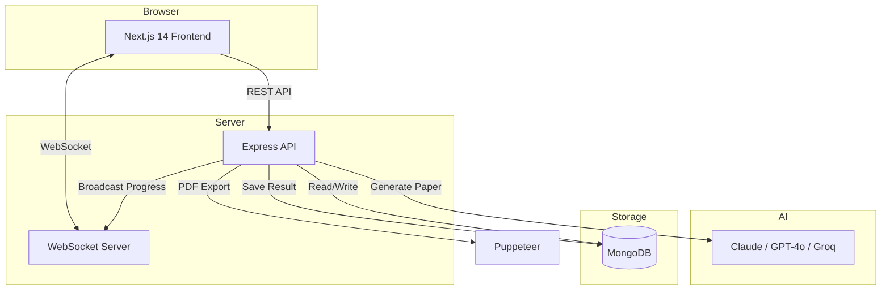

# VedaAI — AI-Powered Assessment Creator

An AI-powered assessment creation platform where teachers create structured question papers using AI. The backend processes assignments as background jobs, generates papers via Claude/GPT-4o, and pushes real-time progress to the frontend via WebSocket.

## Architecture



**Flow:**
1. Teacher fills out the assignment form on the frontend
2. Frontend POSTs to Express API → saves to MongoDB → initiates background job
3. Frontend opens WebSocket connection for real-time updates
4. Express background thread calls AI API (Claude/GPT-4o/Groq)
5. Background thread broadcasts progress updates via WebSocket
6. AI-generated paper is saved to MongoDB and sent to frontend
7. Teacher can view and download the paper as a styled PDF

## Tech Stack

| Layer | Technology |
|-------|-----------|
| Frontend | Next.js 14 (App Router), TypeScript, TailwindCSS, shadcn/ui, Zustand |
| Backend | Node.js, Express, TypeScript |
| Database | MongoDB 7 (Mongoose) |
| Real-time | WebSocket (`ws` library) |
| AI | Anthropic Claude / OpenAI GPT-4o / Groq |
| PDF Export | Puppeteer (server-side) |
| Validation | Zod (frontend + backend) |

## Folder Structure

```
vedaai/
├── apps/
│   ├── frontend/              # Next.js 14 App
│   │   ├── src/
│   │   │   ├── app/           # Pages (App Router)
│   │   │   │   ├── page.tsx                  # Dashboard
│   │   │   │   ├── assignments/
│   │   │   │   │   ├── new/page.tsx          # Assignment creation form
│   │   │   │   │   └── [id]/page.tsx         # Assignment detail/output
│   │   │   │   └── api/parse-pdf/route.ts    # PDF text extraction
│   │   │   ├── components/    # React components
│   │   │   ├── store/         # Zustand store
│   │   │   └── lib/           # Utilities & API client
│   │   └── .env.local
│   │
│   └── backend/               # Express API
│       ├── src/
│       │   ├── config/        # DB, env validation
│       │   ├── models/        # Mongoose schemas
│       │   ├── services/      # AI, PDF, WebSocket services
│       │   ├── middleware/    # Validation, error handling
│       │   ├── routes/        # Express routes
│       │   └── server.ts      # Entry point
│       └── .env
│
├── packages/
│   └── shared/                # Shared TypeScript types & Zod schemas
│       └── src/
│           ├── types.ts
│           ├── schemas.ts
│           └── index.ts
│
├── docker-compose.yml         # MongoDB
├── package.json               # Root (npm workspaces)
└── README.md
```

## Prerequisites

- **Node.js** 18+ (recommended: 20 LTS)
- **Docker** and **Docker Compose** (for MongoDB)
- **API Key**: Anthropic (Claude) or OpenAI (GPT-4o) API key

## Setup

### 1. Clone the repository

```bash
git clone <repo-url>
cd vedaai
```

### 2. Start infrastructure services

```bash
docker compose up -d
```

This starts MongoDB (port 27017).

### 3. Install dependencies

```bash
npm install
```

This installs dependencies for all workspaces (frontend, backend, shared).

### 4. Configure environment variables

**Backend** — copy and edit:
```bash
cp apps/backend/.env.example apps/backend/.env
```

Edit `apps/backend/.env` and add your API key:
```env
PORT=4000
MONGODB_URI=mongodb://localhost:27017/vedaai
GROQ_API_KEY=gsk_tPDlZ...        # Add your primary Groq key
GROQ_API_KEYS=gsk_tPDlZ...,gsk_s0WIUo... # Comma-separated list of fallback Groq keys for automatic rotation
GROQ_MODEL=llama-3.3-70b-versatile    # Groq model
```

**Frontend** — already configured with defaults:
```env
# apps/frontend/.env.local
NEXT_PUBLIC_API_URL=http://localhost:4000
NEXT_PUBLIC_WS_URL=ws://localhost:4000
```

### 5. Start development servers

```bash
npm run dev
```

This starts both:
- **Frontend**: http://localhost:3000
- **Backend**: http://localhost:4000

## API Endpoints

| Method | Endpoint | Description |
|--------|----------|-------------|
| `POST` | `/api/assignments` | Create a new assignment (validates input, enqueues job) |
| `GET` | `/api/assignments` | List all assignments (lightweight, for dashboard) |
| `GET` | `/api/assignments/:id` | Get full assignment details (including result if completed) |
| `GET` | `/api/papers/:id/download` | Download generated paper as PDF |
| `WS` | `/ws?assignmentId=xxx` | WebSocket connection for real-time job updates |

### WebSocket Messages

| Type | Direction | Payload |
|------|-----------|---------|
| `JOB_STARTED` | Server → Client | `{ assignmentId, message }` |
| `JOB_PROGRESS` | Server → Client | `{ assignmentId, progress (0-100), message }` |
| `JOB_COMPLETED` | Server → Client | `{ assignmentId, paper: GeneratedPaper }` |
| `JOB_FAILED` | Server → Client | `{ assignmentId, error }` |

### POST /api/assignments — Request Body

```json
{
  "title": "Mid-Term Mathematics Exam",
  "subject": "Mathematics",
  "grade": "10",
  "schoolName": "Delhi Public School",
  "dueDate": "2024-03-15",
  "totalMarks": 80,
  "duration": 180,
  "questionConfigs": [
    { "type": "mcq", "count": 10, "marksPerQuestion": 1, "difficulty": "easy" },
    { "type": "short_answer", "count": 10, "marksPerQuestion": 3, "difficulty": "medium" },
    { "type": "long_answer", "count": 5, "marksPerQuestion": 5, "difficulty": "hard" }
  ],
  "additionalInstructions": "Focus on algebra and trigonometry",
  "uploadedFileContent": ""
}
```

## Environment Variables

### Backend (`apps/backend/.env`)

| Variable | Required | Default | Description |
|----------|----------|---------|-------------|
| `PORT` | No | `4000` | Server port |
| `MONGODB_URI` | Yes | — | MongoDB connection string |
| `GROQ_API_KEY` | Yes | — | Primary Groq API Key |
| `GROQ_API_KEYS` | No | — | Comma-separated list of alternative Groq API keys for key rotation |
| `GROQ_MODEL` | No | `llama-3.3-70b-versatile` | Model identifier |
| `CORS_ORIGINS` | No | `http://localhost:3000,http://127.0.0.1:3000` | Comma-separated browser origins for REST and WebSocket |

### Frontend (`apps/frontend/.env.local`)

| Variable | Required | Description |
|----------|----------|-------------|
| `NEXT_PUBLIC_API_URL` | Yes | Backend API base URL |
| `NEXT_PUBLIC_WS_URL` | Yes | Backend WebSocket base URL |

## Development

### Running individual services

```bash
# Backend only
npm run dev:backend

# Frontend only
npm run dev:frontend
```

### Docker services

```bash
# Start MongoDB
docker compose up -d

# Stop services
docker compose down

# Stop and remove data
docker compose down -v
```

## License

MIT
